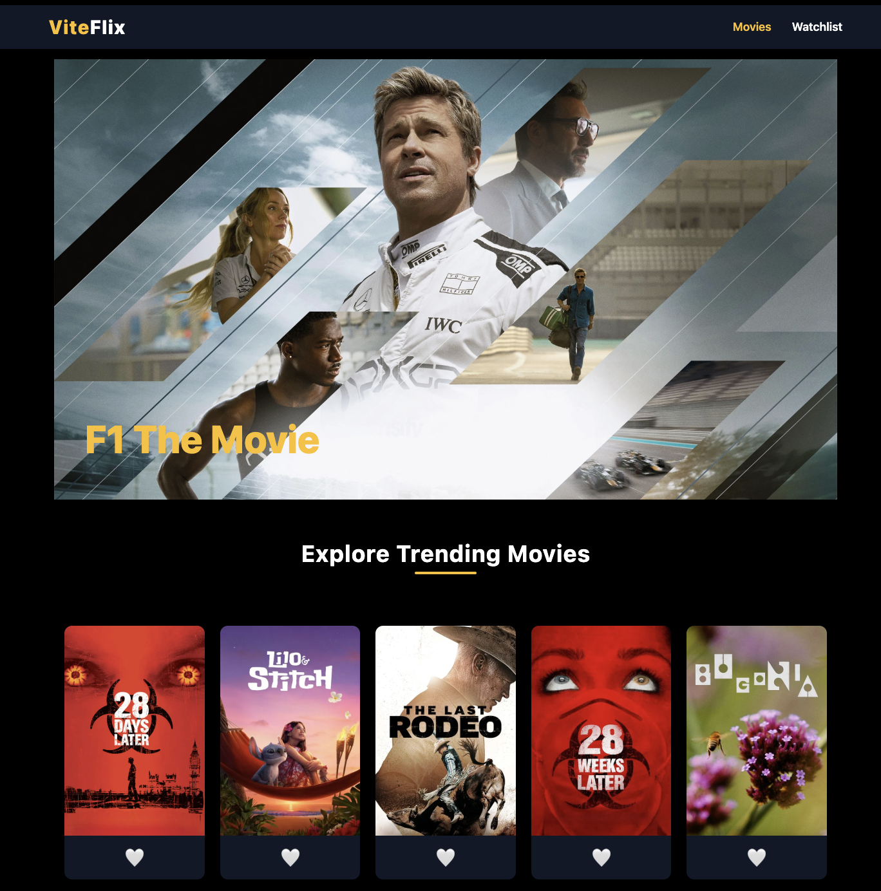
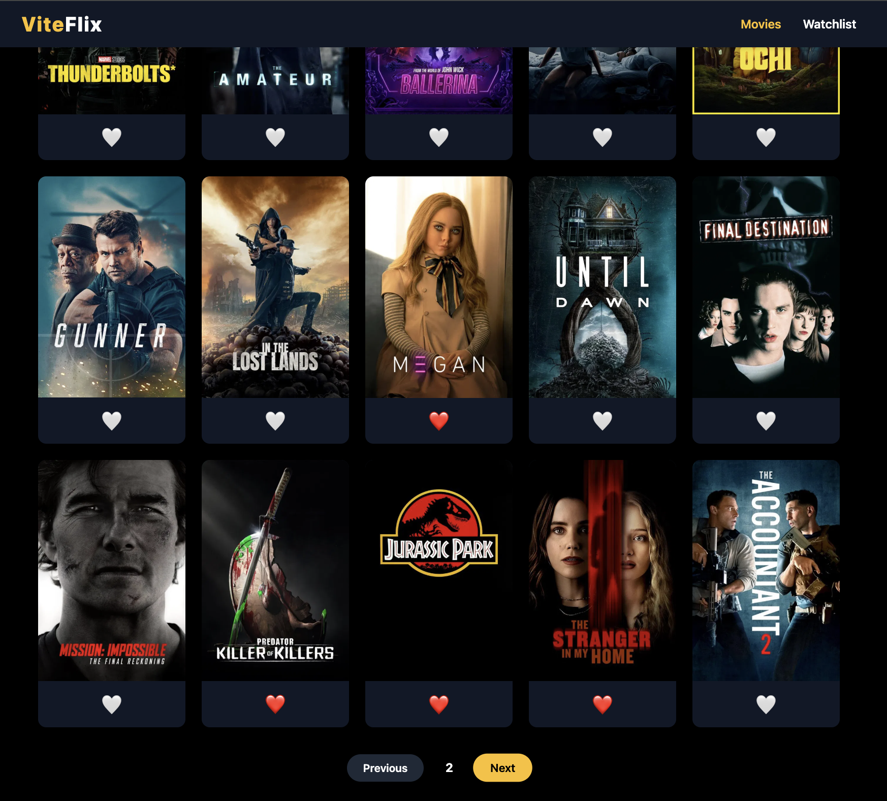
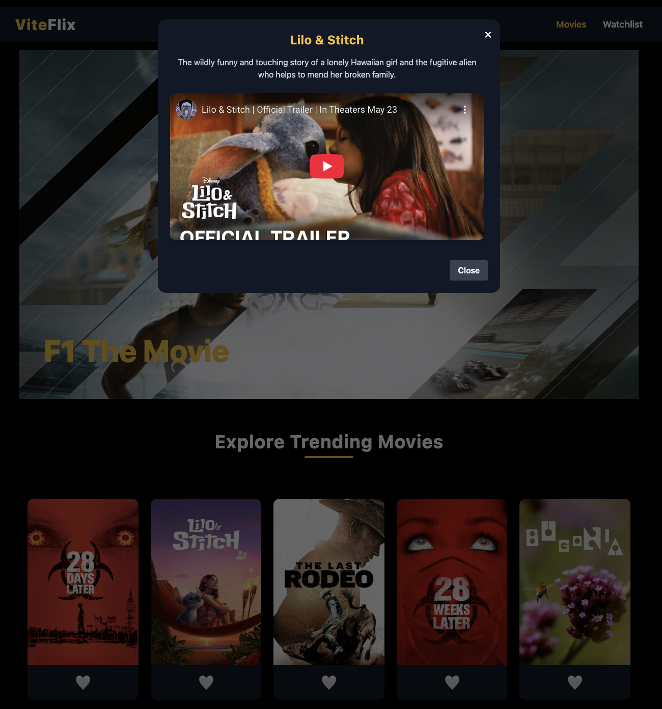
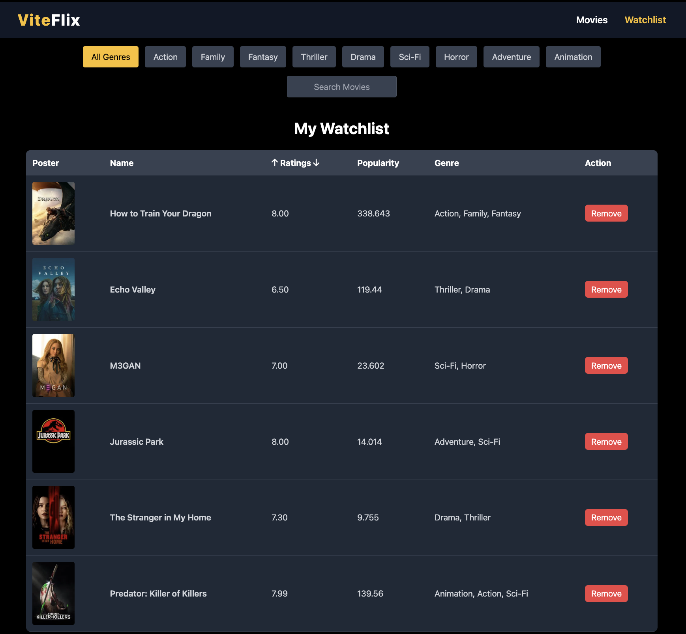

# 🎬 ViteFlix

**ViteFlix** is a sleek, dark-themed movie discovery platform built with **ReactJS**, **Redux Toolkit**, and **TailwindCSS**, powered by the TMDB API. Browse trending movies, filter by genres, and manage your watchlist — all in a lightning-fast, responsive interface.

🔗 **Live Demo**: [viteflixing.netlify.app](https://viteflixing.netlify.app/)

---

## ✨ Key Features

- 🔥 Trending movies powered by **TMDB API**
- 💾 **Watchlist management** (Add/Remove movies)
- 🎯 **Genre-based filtering**
- 🔍 **Instant search** across the movie database
- 📄 **Pagination** for seamless browsing
- 🌙 **Dark mode by default**
- 📱 Fully **responsive UI** (Mobile + Tablet + Desktop)
- 🧠 **Redux-powered** global state persistence

---

## 🛠️ Tech Stack

| Frontend     | State Management | Styling      | API       |
|--------------|------------------|--------------|-----------|
| ReactJS      | Redux Toolkit     | TailwindCSS | TMDB API  |
| React Router |                  |              | Axios     |

---

## 🚀 Getting Started

### 1. Clone the Repository

```bash
git clone https://github.com/sachinsirvi/ViteFlixing.git
cd ViteFlixing
```

### 2. Install Dependencies

```bash
npm install
```

### 3. Add TMDB API Key

Create a `.env` file in the root:

```
VITE_TMDB_API_KEY=your_tmdb_api_key_here
```

👉 [Get your API key](https://www.themoviedb.org/settings/api)

### 4. Run the App Locally

```bash
npm run dev
```

---

## 📸 Screenshots

> These are stored under `/src/assets/`

- **Home Page**  
  

- **Pagination in Action**  
  

- **Trailer Modal**  
  

- **Watchlist Page**  
  


---

## 📬 Contact

**Sachin Sirvi**  
📧 sirvisachin10@gmail.com  
🔗 [LinkedIn](https://www.linkedin.com/in/sachin-sirvi/)  
💻 [GitHub](https://github.com/sachinsirvi)

